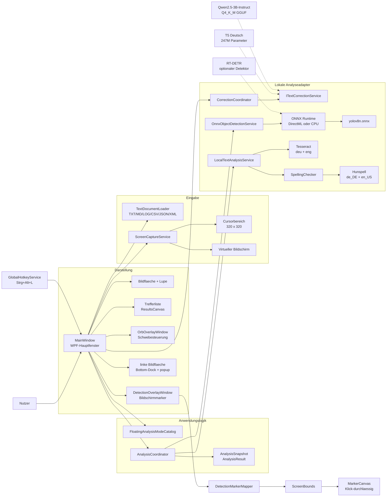
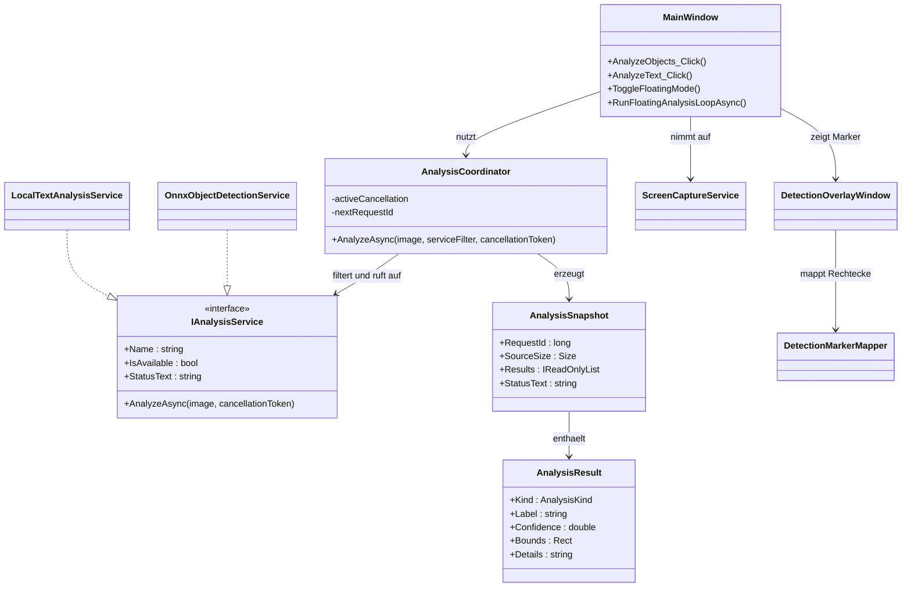
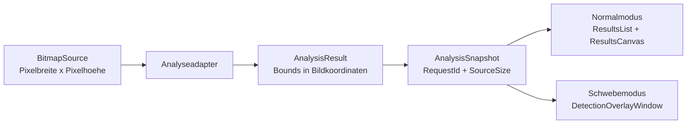
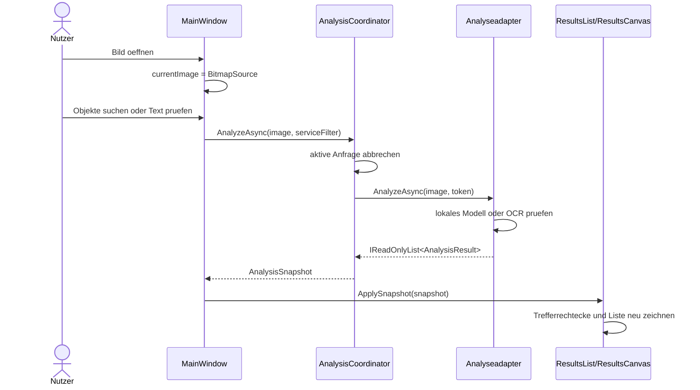
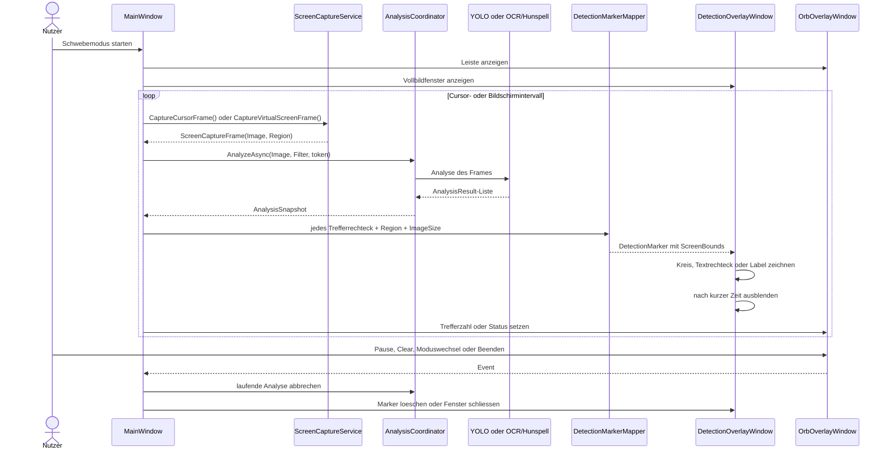
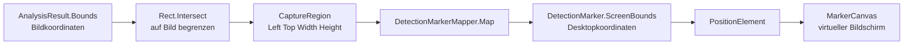
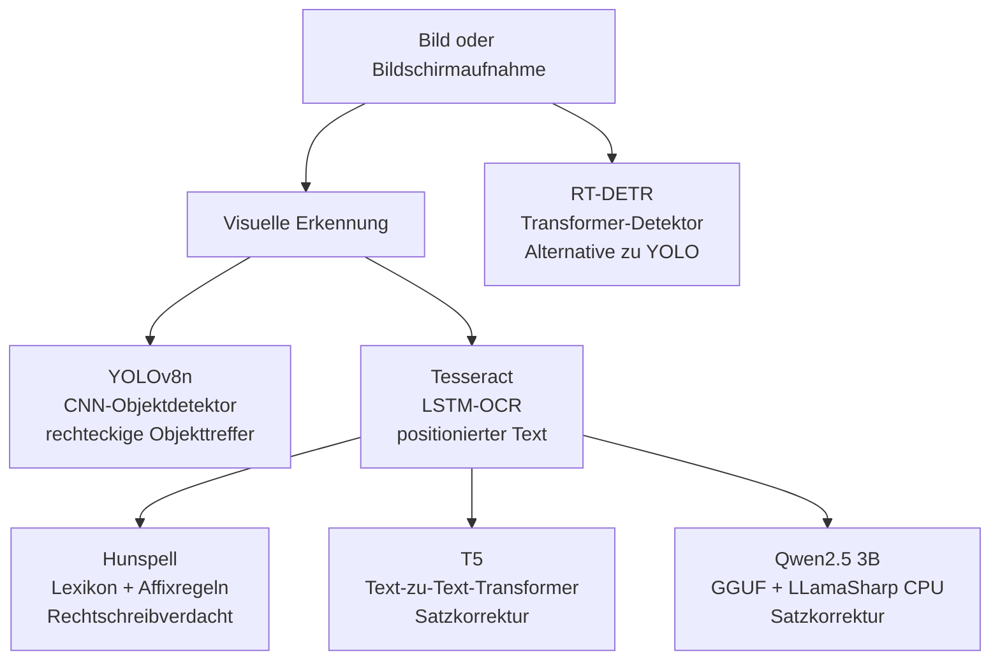
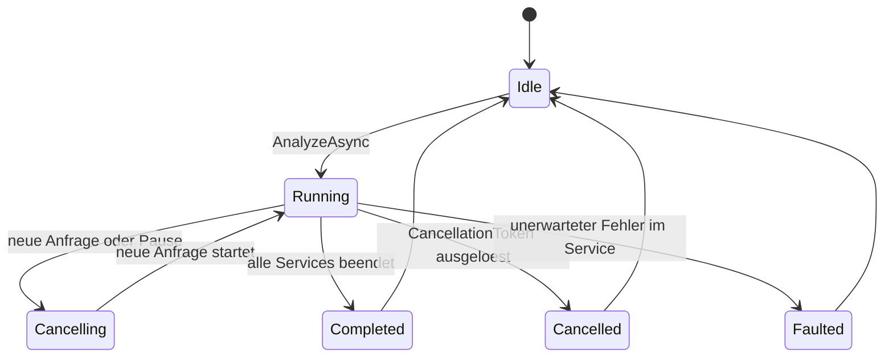

# Ki-Lupe Architektur

> Stand: 2026-09-10

Dieses Dokument beschreibt den aktuellen Aufbau von Ki-Lupe. Es erklaert die Verantwortlichkeiten der Komponenten, die Analysepfade im Normal- und Schwebemodus, die Ergebnisvertraege sowie die Stellen, an denen neue Modelle oder Oberflaechen angebunden werden koennen.

## 1. Leitentscheidungen

- **Lokal zuerst:** Bilder und Bildschirmaufnahmen werden lokal verarbeitet. Es gibt keinen Cloud-Aufruf und keine automatische dauerhafte Speicherung.
- **Ein Ergebnisvertrag:** Objekt-, OCR- und Rechtschreibdienste liefern `AnalysisResult`-Eintraege mit Art, Label, Konfidenz, Bildrechteck und Details.
- **Austauschbare Analyseadapter:** Die UI kennt nur `IAnalysisService` und `AnalysisSnapshot`; Modell- und Bibliotheksdetails bleiben in den Services.
- **Zwei Darstellungswege:** Der Normalmodus zeichnet Treffer auf dem geladenen Bild. Der Schwebemodus projiziert Treffer aus einem Capture-Rechteck auf die echte Bildschirmposition.
- **Abbruch statt veralteter Ergebnisse:** Eine neue Analyse bricht die aktive Analyse ab. Ergebnisse mit einer alten Request-ID werden verworfen.
- **Explizite Modellwahl:** Die UI kann zwischen YOLOv8n und RT-DETR sowie Auto, DirectML und CPU waehlen. Fehlende optionale Artefakte werden als Status gemeldet, statt den Start der Anwendung zu verhindern.
- **Korrektur als eigener Vertrag:** OCR gruppiert erkannte Woerter zu Zeilen; das ausgewaehlte lokale T5- oder LLamaSharp-Modell erzeugt daraus geaenderte Textvorschlaege fuer das Hauptfenster und den Orb-Popup. Hunspell bleibt die Quelle fuer positionierte Wortverdachtsmarker.
- **Textdateien als eigener Eingabepfad:** Lokale TXT-, MD-, LOG-, CSV-, JSON- und XML-Dateien werden BOM-aware gelesen und als schreibgeschuetzter Text angezeigt. `CorrectionCoordinator` prueft ihre nicht leeren Zeilen direkt, ohne kuenstliche `AnalysisResult`-Rechtecke zu erzeugen.
- **Korrektur als linker Bottom-Dock:** Bei sichtbaren Vorschlaegen teilt ein horizontaler `GridSplitter` die linke Bildflaeche in Bild und Korrektur. Die Hoehe bleibt vom Benutzer veraenderbar; die rechte Trefferliste bleibt eigenstaendig.

## 2. Systemuebersicht



### Komponentenrollen

| Bereich | Verantwortliche Typen | Aufgabe |
| --- | --- | --- |
| UI | [`MainWindow.xaml.cs`](../MainWindow.xaml.cs), [`MainWindow.xaml`](../MainWindow.xaml) | Normalmodus, Bildflaeche, Ergebnisliste, Schwebeschleife |
| Schwebesteuerung | [`OrbOverlayWindow.xaml.cs`](../Services/OrbOverlayWindow.xaml.cs), [`FloatingAnalysisModeCatalog.cs`](../Services/FloatingAnalysisModeCatalog.cs) | Pause, Moduswechsel, Ergebnisse anzeigen, Beenden |
| Bildschirmmarker | [`DetectionOverlayWindow.xaml.cs`](../Services/DetectionOverlayWindow.xaml.cs), [`DetectionMarkerMapper.cs`](../Services/DetectionMarkerMapper.cs) | Treffer auf reale Bildschirmkoordinaten projizieren und ausblenden |
| Orchestrierung | [`AnalysisCoordinator.cs`](../Services/AnalysisCoordinator.cs) | Services filtern, Ergebnisse sammeln, Abbruch und Request-ID verwalten |
| Vertrag | [`IAnalysisService.cs`](../Services/IAnalysisService.cs), [`AnalysisResult.cs`](../Models/AnalysisResult.cs) | Gemeinsame Schnittstelle und Ergebnisdaten |
| Eingabe | [`ScreenCaptureService.cs`](../Services/ScreenCaptureService.cs) | Cursor- oder Vollbild-Capture als `ScreenCaptureFrame` |
| Texteingabe | [`TextDocumentLoader.cs`](../Services/TextDocumentLoader.cs), [`TextDocument.cs`](../Models/TextDocument.cs) | Lokale Textdateien groessenbegrenzt und BOM-aware lesen |
| Korrektur | [`CorrectionCoordinator.cs`](../Services/CorrectionCoordinator.cs), [`ITextCorrectionService.cs`](../Services/ITextCorrectionService.cs) | OCR-Zeilen oder Dokumentzeilen ohne Positionsannahme korrigieren |
| Modelle | [`OnnxObjectDetectionService.cs`](../Services/OnnxObjectDetectionService.cs), [`LocalTextAnalysisService.cs`](../Services/LocalTextAnalysisService.cs) | Objekt-, OCR- und Rechtschreibanalyse |
| Konstruktion | [`AnalysisServiceFactory.cs`](../Services/AnalysisServiceFactory.cs) | Standarddienste fuer die laufende Anwendung erzeugen |

## 3. Schichten und Abhaengigkeiten



Die Abhaengigkeitsrichtung verlaeuft von der UI zur Orchestrierung und von dort zu den Analyseadaptern. Die Adapter geben keine WPF-Fenster aus und kennen weder `OrbOverlayWindow` noch `DetectionOverlayWindow`. Dadurch kann eine spaetere UI-Variante denselben Analysevertrag verwenden.

## 4. Ergebnisvertrag

### `AnalysisResult`

Jeder Treffer beschreibt genau eine beobachtete Eigenschaft:

| Feld | Bedeutung |
| --- | --- |
| `Kind` | `Object`, `Text`, `Spelling` oder `Status` |
| `Label` | Objektklasse oder erkannter Text; bei Status eine kurze Meldung |
| `Confidence` | Modell- oder Dienstkonfidenz; OCR/Hunspell verwenden derzeit `1` |
| `Bounds` | Rechteck in Pixelkoordinaten des analysierten Bildes; Status hat kein Rechteck |
| `Details` | Quelle, erkannter Dienst oder zusaetzliche Diagnose |

### `AnalysisSnapshot`

Ein Snapshot bindet die Ergebnisliste an den analysierten Frame:

- `RequestId` identifiziert die Analysegeneration.
- `SourceSize` ist die Pixelgroesse des Eingabebildes.
- `Results` enthaelt Treffer und gegebenenfalls Statusresultate.
- `StatusText` fasst Ergebnisanzahl und Dienststatus fuer die UI zusammen.



Statusresultate werden im Normalmodus in der Trefferliste sichtbar. Das Bildschirm-Overlay ignoriert Statusresultate bewusst, weil sie kein gueltiges Rechteck besitzen; der Text bleibt ueber die Orb-Statusanzeige sichtbar.

## 5. Normalmodus: Bildanalyse



Der Filter entscheidet, welcher Standarddienst fuer die Aktion ausgefuehrt wird:

- `Objekte suchen` waehlt `OnnxObjectDetectionService`.
- `Text pruefen` waehlt `LocalTextAnalysisService`.
- Eine allgemeine Analyse kann alle verfuegbaren Dienste anfordern.

Die `AnalysisServiceFactory` registriert genau einen ausgewaehlten Objektdienst (YOLOv8n oder RT-DETR) und den OCR-Dienst. Beim Wechsel in der UI werden beide Analysepfade kontrolliert neu aufgebaut.

Nach einem Text-Snapshot gruppiert `CorrectionCoordinator` OCR-Woerter zu Zeilen und ruft fuer jede nicht leere Zeile den ausgewaehlten lokalen T5- oder LLamaSharp-Adapter auf. Nicht leere, veraenderte Vorschlaege werden ueber `CorrectionPresentationState` request-id-geschuetzt gleichzeitig im Hauptfenster und am Orb dargestellt. Hunspell entscheidet weiterhin unabhaengig, welche Woerter als positionierte Verdachtsmarker erscheinen.

Im Hauptfenster wird der Vorschlag als unterer Bereich innerhalb der linken Bildflaeche dargestellt. Ein `GridSplitter` zwischen Bild und Korrektur erlaubt die Anpassung der Hoehe. Ohne Vorschlag bleiben Splitter und Korrekturbereich ausgeblendet, sodass die Bildflaeche den gesamten linken Bereich nutzt. Die Trefferliste rechts deaktiviert horizontales Scrollen und bricht lange Labels sowie Details um.

### Textdatei-Eingabe

`Textdatei laden` verwendet `TextDocumentLoader` fuer `.txt`, `.md`, `.log`, `.csv`, `.json` und `.xml`. Der Loader akzeptiert UTF-8 ohne BOM sowie UTF-8/UTF-16 mit BOM, bewahrt den Originaltext und teilt ihn fuer die Korrektur an Zeilenumbruechen auf. Dateien groesser als 10 MB werden abgewiesen. Die UI zeigt den Inhalt schreibgeschuetzt an und verwirft beim Wechsel die alten Bildtreffer und Korrekturen.

Bei `Text pruefen` werden die Dokumentzeilen direkt an `CorrectionCoordinator` und den gewaehlten `ITextCorrectionService` gegeben. Leere Zeilen werden uebersprungen; null-, leere und unveraenderte Modellantworten werden verworfen. Da kein Bildbezug existiert, werden keine `AnalysisResult`-Objekte, Rechtecke oder Bildschirmmarker erzeugt. Die Quelldatei wird nie ueberschrieben.

## 6. Schwebemodus: Capture bis Marker



### Die vier Modi

[`FloatingAnalysisModeCatalog.cs`](../Services/FloatingAnalysisModeCatalog.cs) beschreibt den Modus fachlich und stellt drei Entscheidungen zentral bereit: Label, Text- oder Objektservice sowie Cursor- oder Vollbildaufnahme.

| Modus | Analyse | Eingabe | Intervall nach einem Durchlauf |
| --- | --- | --- | --- |
| `ObjectsCursor` | YOLO-ONNX | 320 x 320 um den Cursor | ca. 450 ms |
| `TextCursor` | Tesseract + Hunspell | 320 x 320 um den Cursor | ca. 450 ms |
| `ObjectsScreen` | YOLO-ONNX | virtueller Bildschirm | ca. 1800 ms |
| `TextScreen` | Tesseract + Hunspell | virtueller Bildschirm | ca. 1800 ms |

Die Intervallsteuerung liegt in der Schwebeschleife von `MainWindow`. `AnalysisCoordinator` ist fuer Abbruch, Aggregation und Request-Generation zustaendig, nicht fuer die Zeitplanung des Loops.

## 7. Koordinatentransformation und Marker

Analyseadapter liefern Rechtecke relativ zum Eingabebild. Bei einem Cursor-Capture ist dieses Bild nur ein kleiner Ausschnitt des Bildschirms; deshalb muss das Rechteck ueber die Capture-Region zurueck auf den Desktop projiziert werden.



Die Umrechnung verwendet sinngemaess:

```text
screenX = capture.Left + imageX * capture.Width / imageWidth
screenY = capture.Top  + imageY * capture.Height / imageHeight
```

`DetectionOverlayWindow` ist ein eigenes, transparentes Fenster ueber dem virtuellen Bildschirm. Es besitzt `WS_EX_TRANSPARENT`, bleibt ausserhalb seiner Steuerung klickdurchlaessig und wird per `SetWindowDisplayAffinity` aus der naechsten Bildschirmaufnahme ausgeschlossen. Dadurch analysiert der Schwebemodus nicht seine eigenen Marker.

Die Darstellungsregeln sind:

- Objekte: gruener Kreis mit kleinem Label unterhalb des Kreises.
- OCR-Text: cyanfarbenes Rechteck mit Textlabel.
- Rechtschreibverdacht: orange-roter Unterstrich mit Textlabel.
- Status: kein Bildschirmmarker, nur Statusanzeige bzw. Trefferliste.

## 8. Verwendete Modellarten

Ki-Lupe kombiniert mehrere Modell- und Analysearten. Nicht jede Komponente ist ein Machine-Learning-Modell: Hunspell arbeitet lexikon- und regelbasiert, liefert dafuer direkt pruefbare Wortentscheidungen.

| Komponente | Modell-/Verfahrenstyp | Aufgabe | Laufzeitstatus |
| --- | --- | --- | --- |
| `yolov8n.onnx` | YOLOv8 Nano, einstufiger CNN-basierter Objektdetektor | Objektklassen und Begrenzungsrechtecke erkennen | **Produktiv aktiv** ueber ONNX Runtime; DirectML wird bevorzugt, CPU ist Fallback |
| `deu.traineddata` / `eng.traineddata` | Tesseract-OCR mit trainierten LSTM-Sprachmodellen | Deutsche und englische Woerter mit Positionen auslesen | **Produktiv aktiv** |
| `de_DE` / `en_US` | Hunspell-Woerterbuecher mit Affixregeln, kein ML-Modell | Moegliche Rechtschreibfehler pro OCR-Wort pruefen | **Produktiv aktiv** |
| RT-DETR ONNX | Transformer-basierter Echtzeit-Objektdetektor aus der DETR-Familie | Alternative Objekterkennung mit eigenem Output-Parser | **Ueber UI auswaehlbar** |
| `Vinctilus/onnx-oliverguhr-spelling-correction-german-base` | T5-basierter Text-zu-Text-Transformer, 247 Mio. Parameter | Rechtschreibung sowie teilweise Gross-/Zeichensetzung korrigieren; keine verlaessliche allgemeine Grammatikpruefung | **Optional ueber UI auswaehlbar**, Apache-2.0 |
| `Qwen2.5-3B-Instruct-Q4_K_M.gguf` | Quantisiertes lokales Instruct-LLM ueber LLamaSharp | Rechtschreibung, Grammatik, Grossschreibung und Zeichensetzung als geaenderte OCR-Zeile korrigieren | **Optional ueber UI auswaehlbar**, CPU-Backend; Lizenz des konkreten Artefakts beachten |
| `aiassociates/t5-small-grammar-correction-german` | T5-basierter Sequenz-zu-Sequenz-Transformer | Deutsche Grammatik- und Schreibkorrektur als neuer Satz | **Separat evaluiert**, wegen Lizenz nicht standardmaessig integriert |



Wichtig fuer die Architektur: YOLO, RT-DETR und Tesseract liefern lokalisierbare Ergebnisse oder koennen auf solche Ergebnisse abgebildet werden. T5-Satzkorrektur liefert dagegen primaer einen **neuen korrigierten Text**. Deshalb kann das Modell nicht ohne zusaetzliche Wort-/Zeilen-Ausrichtung einzelne Grammatikfehler sicher als Bildschirmrechteck markieren.

## 9. Analyseadapter und lokale Ressourcen

### Objektanalyse

[`OnnxObjectDetectionService`](../Services/OnnxObjectDetectionService.cs) sucht `yolov8n.onnx` neben der Anwendung oder im aktuellen Projektverzeichnis. Der Adapter:

1. erstellt ein `640 x 640` RGB-Tensorbild,
2. versucht DirectML als Execution Provider,
3. faellt bei Problemen auf CPU zurueck,
4. liest die Modellkandidaten und erzeugt `Object`-Ergebnisse,
5. skaliert und begrenzt die Rechtecke auf die Quellbildgroesse.

Das Ergebnislabel kommt aus der COCO-Klassenliste. Eine fehlende oder ungueltige Modelldatei deaktiviert nur die Objekterkennung und wird als `StatusText` gemeldet.

### OCR und Rechtschreibung

[`LocalTextAnalysisService`](../Services/LocalTextAnalysisService.cs) laedt Tesseract mit `deu+eng`. Fuer jedes erkannte Wort erzeugt der Adapter:

1. ein `Text`-Ergebnis mit dem Tesseract-Rechteck,
2. optional ein zusaetzliches `Spelling`-Ergebnis mit demselben Rechteck.

[`SpellingChecker`](../Services/SpellingChecker.cs) prueft Deutsch und Englisch unabhaengig. Dadurch kann ein einzelnes fehlendes Woerterbuch gemeldet werden, ohne die jeweils andere Sprache abzuschalten.

Erwartete Dateien:

```text
tessdata/deu.traineddata
tessdata/eng.traineddata
dictionaries/de_DE.aff
dictionaries/de_DE.dic
dictionaries/en_US.aff
dictionaries/en_US.dic
yolov8n.onnx
```

Die MSBuild-Regeln in [`KiLupeDemo.csproj`](../KiLupeDemo.csproj) kopieren OCR-, Woerterbuch- und YOLO-Dateien neben die Anwendung. Die Dateien werden als lokale Artefakte behandelt und nicht in den Quellcode eingecheckt.

### Experimentelle Adapter

- [`RtdetrObjectDetectionService.cs`](../Services/RtdetrObjectDetectionService.cs) ist ein eigenstaendiger RT-DETR-ONNX-Adapter mit eigenem Output-Parser. Die Factory aktiviert ihn, wenn RT-DETR in der UI ausgewaehlt wird.
- [`OnnxTextCorrectionService.cs`](../Services/OnnxTextCorrectionService.cs) nutzt den lokalen vollstaendigen `model.onnx`-Graphen des 247M-T5-Modells mit Encoder- und Decoder-Eingaben sowie `tokenizer.json`. [`LocalLlamaTextCorrectionService.cs`](../Services/LocalLlamaTextCorrectionService.cs) laedt das optionale GGUF lazy ueber LLamaSharp und erzeugt pro OCR-Zeile einen frischen CPU-Kontext. Beide Vorschlaege sind bewusst Zeilenanzeigen und keine separaten Bildschirmmarker, weil ein generierter Satz keine belastbaren neuen Wortrechtecke liefert.

## 10. Nebenlaeufigkeit, Abbruch und Fehler



`AnalysisCoordinator` haelt unter einem Lock:

- die aktuell aktive `CancellationTokenSource`,
- eine fortlaufende `nextRequestId`,
- den Entsorgungsstatus.

Bei einer neuen Anfrage wird die alte Anfrage abgebrochen. Vor der Rueckgabe prueft der Koordinator erneut, ob die Request-ID noch aktuell ist. So kann ein langsamer OCR- oder ONNX-Lauf kein altes Bild ueber ein neueres Ergebnis legen.

Fehler werden auf Dienstgrenzen behandelt:

- fehlende Modelldatei oder Sprachdaten: `IsAvailable == false` und konkreter Status,
- fehlendes Qwen-GGUF oder ein Fehler beim nativen LLamaSharp-Laden: sichtbarer Status ohne UI-Absturz,
- DirectML nicht verfuegbar: CPU-Fallback,
- Analysefehler waehrend des Laufs: `Status`-Ergebnis statt UI-Absturz,
- Abbruch: kein Snapshot fuer eine veraltete Anfrage.

## 11. Testarchitektur

Die Tests liegen in [`tests/KiLupeDemo.Tests`](../tests/KiLupeDemo.Tests) und pruefen die tiefsten, plattformunabhaengigsten Grenzen bevorzugt isoliert:

| Testbereich | Beispiele |
| --- | --- |
| Koordination | Request-ID, Abbruch alter Anfragen, Statusweitergabe |
| Ergebnisvertrag | `AnalysisResult`, Snapshot-Aggregation |
| OCR/Rechtschreibung | Asset-Pfade, Tesseract-Ausgabe, unabhaengige Hunspell-Dictionaries |
| Textkorrektur | fehlendes GGUF, Promptvertrag, Factory-Auswahl; optionaler Smoke-Test mit lokalem Qwen-Modell |
| Textdateien | BOM-aware UTF-8/UTF-16-Laden, Endungen, leere/zu grosse/ungueltige Dateien; direkte Zeilenkorrektur und Abbruch |
| Objektmodellle | YOLO- und RT-DETR-Output-Parsing sowie Smoke-Tests mit lokalen Modellen |
| Bildschirmmarker | Capture-Region-Umrechnung in Desktopkoordinaten |
| Schwebemodi | zyklische Auswahl von Text/Objekt und Cursor/Bildschirm |
| Capture | Begrenzung von Cursorregionen und virtuellem Bildschirm |

Standardpruefung:

```powershell
dotnet test tests/KiLupeDemo.Tests/KiLupeDemo.Tests.csproj --no-restore
dotnet build KiLupeDemo.csproj
```

Fuer die vollstaendige manuelle Pruefung bleibt ein Windows-Lauf mit Bild oeffnen, Schwebemodus, Hotkey, Pause, Moduswechsel, klickdurchlaessigem Overlay und CPU-Fallback erforderlich.

## 12. Erweiterungspunkte

### Einen weiteren Analysedienst hinzufuegen

1. `IAnalysisService` implementieren.
2. `AnalysisResult` mit Bildrechteck und sinnvollem `Kind` erzeugen.
3. Dienst in [`AnalysisServiceFactory.cs`](../Services/AnalysisServiceFactory.cs) registrieren, wenn er Teil des Standardlaufs sein soll.
4. Einen passenden Filter in `MainWindow` oder einen neuen `FloatingAnalysisMode` ergaenzen.
5. Falls die Darstellung eine neue Form braucht, `DetectionMarkerMapper` und `DetectionOverlayWindow` erweitern.
6. Zuerst Parser, Mapping und Statusverhalten testen; danach den WPF-Lauf manuell pruefen.

### Einen weiteren Renderer anbinden

Ein Renderer sollte `AnalysisSnapshot` konsumieren und nicht direkt auf Tesseract-, ONNX- oder Hunspell-Typen zugreifen. Fuer Bildschirmpositionen muss er ausserdem die `CaptureRegion` kennen. So bleibt die Analyse von der konkreten Darstellung getrennt.

## 13. Bewusste Grenzen

- Die Anwendung ist Windows-/WPF-spezifisch und zielt auf `.NET 8`.
- Textdateien sind auf `.txt`, `.md`, `.log`, `.csv`, `.json` und `.xml` sowie 10 MB Dateigroesse begrenzt. PDF, DOCX, RTF und ODT sowie semantische Strukturinterpretation oder Bearbeitung von CSV/JSON/XML sind bewusst nicht enthalten.
- Die aktuelle Textfunktion findet OCR-Woerter und moegliche Rechtschreibfehler; sie ist keine vollstaendige Grammatikpruefung.
- Satzkorrektur wird nicht automatisch in Rechtecke oder einzelne Fehlerarten uebersetzt.
- Korrekturvorschlaege fuer Bild- und Textpfade werden nur angezeigt oder kopiert; Quelldateien werden nicht automatisch gespeichert oder veraendert.
- Der Hauptfenster-Korrekturbereich ist derzeit unten an die linke Bildflaeche gedockt und ueber einen horizontalen Splitter in der Hoehe veraenderbar; freies Drag-and-Drop-Docking ist bewusst noch nicht Teil der UI.
- RT-DETR ist als alternativer Detektor vorbereitet, getestet und ueber die laufende UI auswaehlbar.
- Die Korrekturmodelle bleiben optional: Ohne `model.onnx`/`tokenizer.json` oder das Qwen-GGUF bleibt die jeweilige Auswahl deaktiviert und die anderen Analysepfade laufen weiter. `spiece.model` wird fuer die lokale Modellablage mitgeladen, ist aber fuer den aktuellen T5-.NET-Adapter nicht der verwendete Tokenizerpfad. Das Qwen-GGUF wird nicht automatisch geladen oder ueber das Netzwerk nachgeladen.
- Bildschirmbilder bleiben waehrend der Analyse im Speicher; die Anwendung bietet keine automatische Archivierung oder Cloud-Synchronisierung.

## 14. Weiterfuehrende Dokumente

- [README und Startanleitung](../README.md)
- [Design der WPF-Version](superpowers/specs/2026-09-09-ki-lupe-design.md)
- [Design der Bildschirmmarker](superpowers/specs/2026-09-09-ki-lupe-detection-markers-design.md)
- [Design der hybriden Modelltests](superpowers/specs/2026-09-10-ki-lupe-hybrid-models-design.md)
